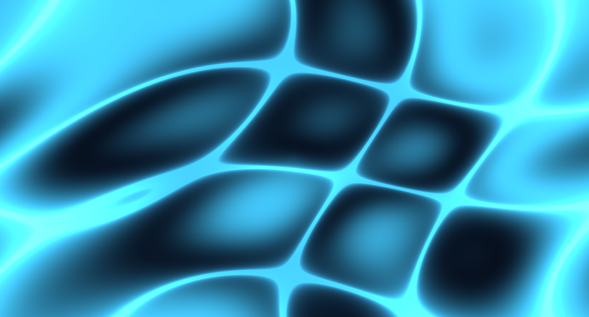
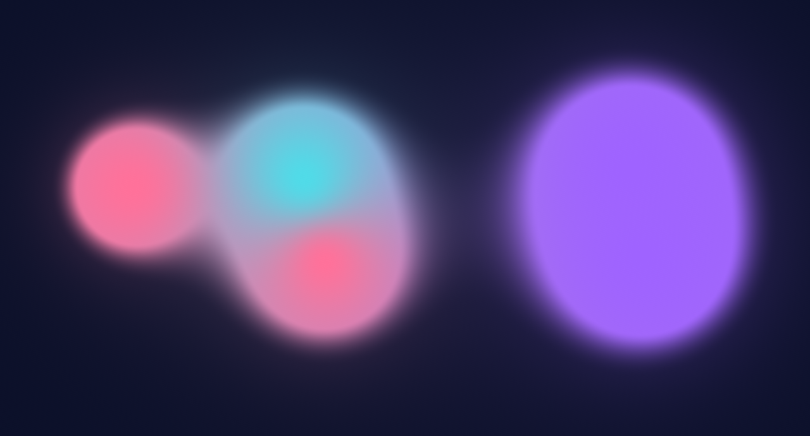
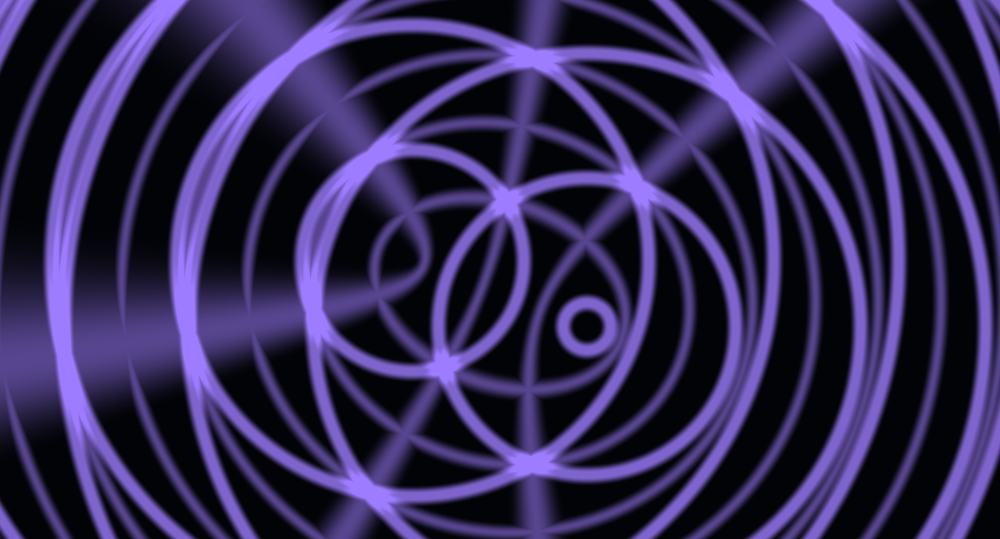
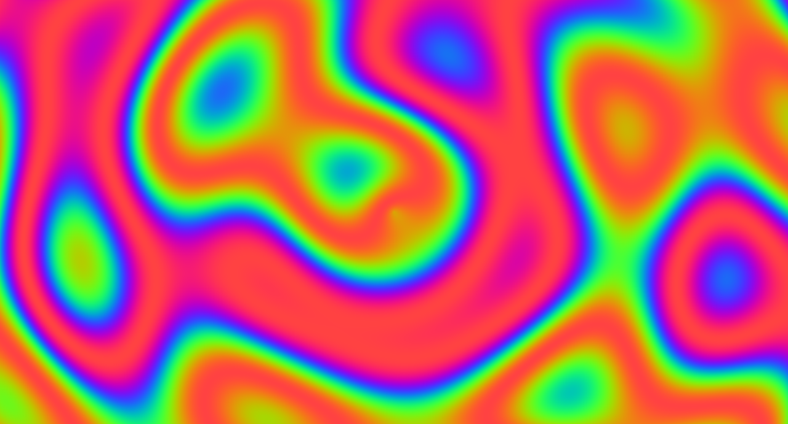
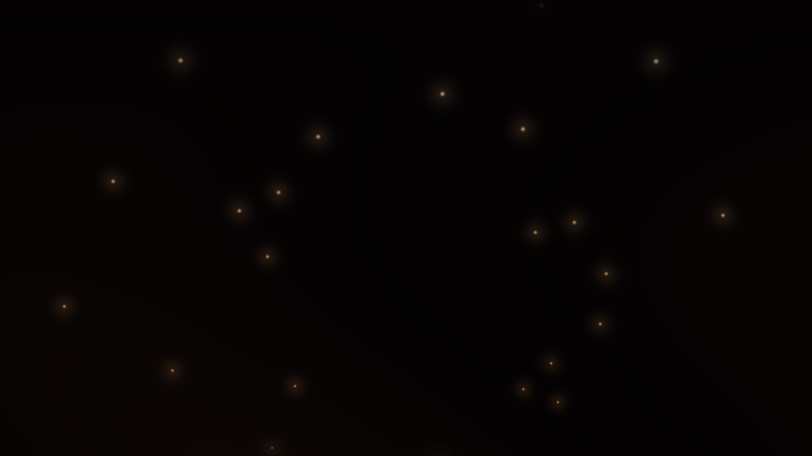
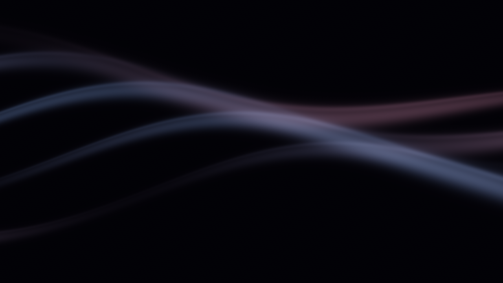
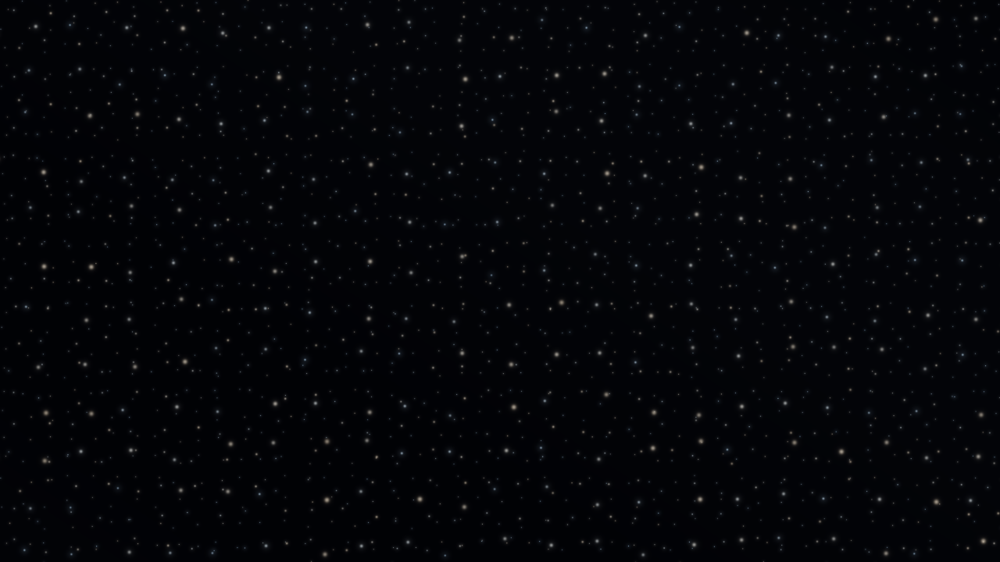
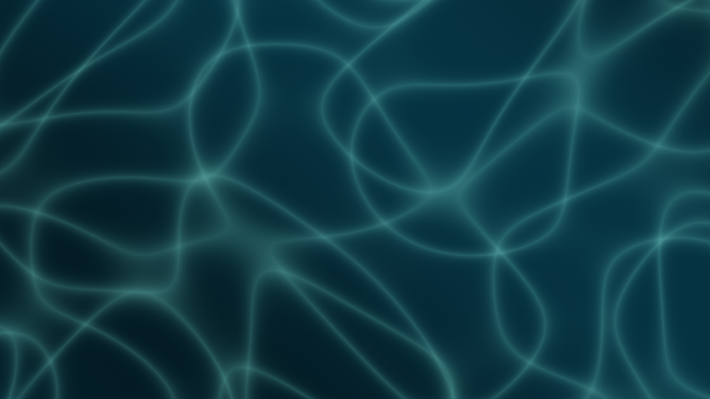

# scrnsvr

A shader-based idle screensaver for Linux desktops. Electron + WebGL (OGL) renderers launch fullscreen after a configurable idle timeout, with a settings UI, clock overlay, and systemd user service.

## Gallery

Click a screenshot to watch the 5-second animated preview (H.264 MP4, ~640px).

| | | |
|---|---|---|
| [](assets/videos/aurora-veil.mp4) | [](assets/videos/flow-field.mp4) | [](assets/videos/gradient-blobs.mp4) |
| **Aurora Veil** · [video](assets/videos/aurora-veil.mp4) | **Flow Field** · [video](assets/videos/flow-field.mp4) | **Gradient Blobs** · [video](assets/videos/gradient-blobs.mp4) |
| [](assets/videos/gradient-drift.mp4) | [](assets/videos/interference.mp4) | [](assets/videos/mesh-gradient.mp4) |
| **Gradient Drift** · [video](assets/videos/gradient-drift.mp4) | **Orbital Interference** · [video](assets/videos/interference.mp4) | **Mesh Gradient** · [video](assets/videos/mesh-gradient.mp4) |
| [](assets/videos/plasma.mp4) | [](assets/videos/contour-dunes.mp4) | [](assets/videos/ember-drift.mp4) |
| **Chromatic Plasma** · [video](assets/videos/plasma.mp4) | **Contour Dunes** · [video](assets/videos/contour-dunes.mp4) | **Ember Drift** · [video](assets/videos/ember-drift.mp4) |
| [](assets/videos/silk-ribbons.mp4) | [](assets/videos/star-drift.mp4) | [](assets/videos/tidal-caustics.mp4) |
| **Silk Ribbons** · [video](assets/videos/silk-ribbons.mp4) | **Star Drift** · [video](assets/videos/star-drift.mp4) | **Tidal Caustics** · [video](assets/videos/tidal-caustics.mp4) |

Media is captured headlessly at 1280×720 (stills) / 640px 12 fps (video) via `scripts/capture-frames.cjs` + ffmpeg:

```sh
npx electron scripts/capture-frames.cjs --shader plasma --out /tmp/frames-plasma --frames 61 --fps 12 --width 1280 --height 720
ffmpeg -framerate 12 -i /tmp/frames-plasma/frame-%03d.png -vf "scale=640:-2" -c:v libx264 -pix_fmt yuv420p -crf 23 -movflags +faststart assets/videos/plasma.mp4
```

## Features

- 12 GLSL shaders: `aurora-veil`, `contour-dunes`, `ember-drift`, `flow-field`, `gradient-blobs`, `gradient-drift`, `interference`, `mesh-gradient`, `plasma`, `silk-ribbons`, `star-drift`, `tidal-caustics`
- 12–17 controls per shader, grouped into Motion, Shape, and Color, with Advanced adjustments, numeric entry, individual resets, and saved presets
- Clock overlay: 12h/24h, seconds/date toggles, 9 positions, font/weight/size/color/opacity/margin/shadow
- Noctalia colors import: maps `mPrimary/mSecondary/mTertiary/mSurface/mOnSurface` onto shader color uniforms
- Idle daemon: polls `powerMonitor.getSystemIdleTime()` with a `logind` (`busctl`) fallback; suppresses relaunch for one poll after resume
- Primary / all-monitors rendering, kiosk mode, configurable FPS (1–240)
- Settings window by default (argless or `--settings`); screensaver via `--open` (fullscreen) or `--preview --shader <id>` (windowed); headless thumbnail capture (`--thumbnail`)
- Config at `~/.config/scrnsvr/config.json` (or `$XDG_CONFIG_HOME/scrnsvr/config.json`), Zod-validated with atomic writes
- Linux packaging: AppImage + deb via electron-builder, ships a systemd user unit (`scrnsvr.service`)

## Requirements

- Linux with Node 24 + npm
- Electron 44 (devDependency, allowed via `allowScripts`)
- `busctl` only if you rely on the logind idle fallback (Wayland without Electron idle data)

## Quick start

```sh
npm install
npm run build

# Open settings (default, no flags needed)
npm run settings

# Run the screensaver fullscreen
npx electron dist/main/index.js --open
# Preview a shader in a window
npm start -- --preview --shader gradient-blobs

# Run the idle daemon in the foreground
npm run daemon

# Typecheck / tests
npm run typecheck
npm test
# Chromium/WebGL rendering and settings integration checks (desktop or Xvfb)
npm run check-shaders
```

CLI flags (`src/main/cli.ts`): `--settings|-s`, `--open`, `--daemon`, `--preview`, `--shader <id>`, `--thumbnail`, `--output <dir>`, `--frames <n>`.

## Shader controls

Choose a shader and adjust its sliders for a live preview. Numeric fields accept precise values when you press Enter or leave the field. Each control has its own Reset button; Reset shader restores all defaults. Open **Advanced** for finer motion, geometry, and color adjustments. Randomize respects slider steps and conservative motion ranges while keeping background colors unchanged.

Every shader supports speed, brightness, and saturation. Speed at zero freezes animation; saturation at zero produces grayscale. Plasma's **Custom** palette exposes three color controls, and Flow Field's **Duotone** palette exposes a secondary color. Existing settings and presets retain their values, with newly added parameters taking their defaults.

See the [shader parameter guide](docs/shader-parameters.md) for the available adjustments.

## Config

Resolved by `configPath()` in `src/shared/config.ts`:

- active shader, global FPS / idle threshold / monitor scope, clock block, `shaders` values, `presets`
- legacy top-level `fps`/`monitor` keys are migrated into `global` on load

Example (`~/.config/scrnsvr/config.json`):

```json
{
  "shader": "gradient-blobs",
  "global": { "idleThresholdSeconds": 300, "fps": 60, "monitors": "primary" },
  "kiosk": true,
  "clock": { "enabled": true, "position": "center", "format": "24h", "showSeconds": false, "showDate": true },
  "shaders": { "plasma": { "speed": 0.65 } },
  "presets": {}
}
```

## Packaging

```sh
npm run dist
```

Outputs to `release/` (AppImage, deb). The deb `afterInstall` hook installs the user unit to `/usr/lib/systemd/user/scrnsvr.service`; enable with:

```sh
systemctl --user daemon-reload
systemctl --user enable --now scrnsvr.service
```

## Project layout

- `src/main/` — Electron entry, CLI, idle daemon, Noctalia loader, IPC (`config:get/set`, `colors:import-noctalia`)
- `src/renderer/` — OGL runtime (`core/runtime.ts`), clock overlay (`core/clock.ts`), shader set (`shaders/*/manifest.ts` + `shader.glsl`)
- `src/settings/` — settings window UI + clock controls
- `src/shared/` — Zod config, clock/Noctalia helpers, IPC keys, shader manifest schema
- `scripts/build.mjs` — esbuild bundles for main/preload/renderer/settings + static copies
- `scripts/generate-shader-registry.mjs` — generates `src/renderer/shaders/generated.ts`
- `tests/` — vitest suites for CLI, config, daemon, Noctalia, uniforms (14 tests)
- `packaging/` — systemd unit + deb post-install script
